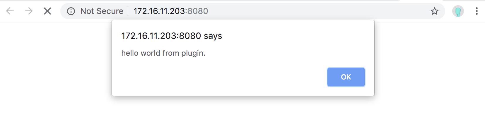

# Webpack打包Vue插件以及部署流程测试

## 安装和使用

### 在终端使用下面的命令

```
yarn add @curder/hello-world
```
> 如果需要强制安装某个版本，可以执行 `yarn add @curder/hello-world@0.0.4`

### 在JS入口文件
```
import Vue from 'vue';
import HelloWorld from '@curder/hello-world';

Vue.component('hello-world', HelloWorld);
```

### 在项目组件中使用

```
<hello-world></hello-world>
```

### 效果如下


## 本地开发

```
yarn watch
```

## 执行编译

```
yarn prod
```

## 执行部署

```
yarn publish
```
> 如果需要指定版本发布，可以使用 `yarn publish 0.0.4`